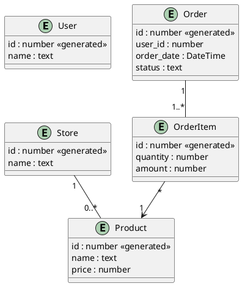
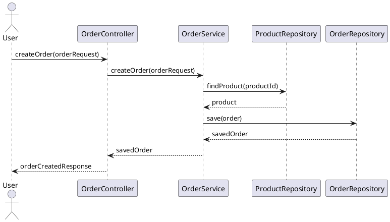
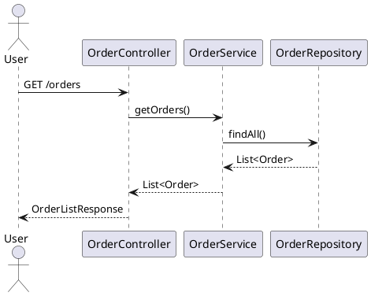
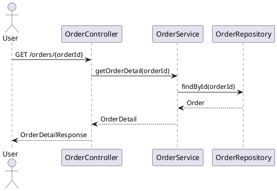

- interface 객체지향 3요소, 5원칙
  - 3요소
    1. 캡슐화
    2. 상속
    3. 다형성
  - 5원칙: SOLID
    1. 단일 책임 원칙 (Single Responsibility Principle)
    2. 개방-폐쇄 원칙 (Open-Closed Principle)
    3. 리스코프 치환 원칙 (Liskov Substitution Principle)
    4. 인터페이스 분리 원칙 (Interface Segregation Principle)
    5. 의존 관계 역전 원칙 (Dependency Inversion Principle)
- spring data jpa interface를 왜 쓰지 말라고 하는지? 
  - 위 원칙을 위반하나?
  - 
- spring data jpa는 어떻게 생겨난건지? 
- 어떻게 써야하는지?

예시 코드)  
간단한 주문 시스템을 만들어보자.  

#### 엔티티

#### 기능
1. 가게에서 상품을 주문한다.
2. 나의 주문내역을 조회한다.
3. 주문 상세정보를 조회한다.

#### 시퀀스 다이어그램
시나리오: `가게에서 상품을 주문한다.`
1. 사용자가 주문 생성 요청
2. 주문 서비스가 주문 생성
3. 주문 서비스가 주문 항목 저장
4. 주문 저장 완료

시나리오: `나의 주문내역을 조회한다.`
1. 사용자는 본인의 전체 주문 목록을 조회
2. 해당 사용자의 주문 목록을 반환 (현재는 사용자 정보 없이 주문 전체 조회로 가정)

시나리오: `주문 상세정보를 조회한다.`
1. 사용자가 주문 ID를 지정하여 해당 주문의 상세 정보를 요청
2. 해당 주문과 주문 항목 목록, 각 항목의 상품 정보를 포함해 반환

ACID
Atomicity 원자성 
Consistency 일관성 
Isolation 고립성 
Durability 지속성

